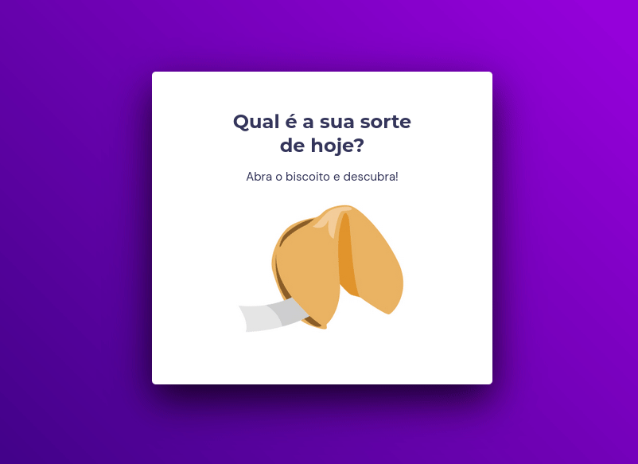

<h1 align="center"> Biscoito da sorte </h1>

 

## 🚀 Tecnologias

Esse projeto foi desenvolvido com as seguintes tecnologias:

- HTML
- CSS
- JavaScript

 

 
<h3 align="center">Tela do projeto</h3>

 
  

 

## 💻 Projeto

O projeto foi desenvolvido no curso **Explorer** da **Rocketseat** e tem como objetivo treinar as tecnologias utilizadas.
