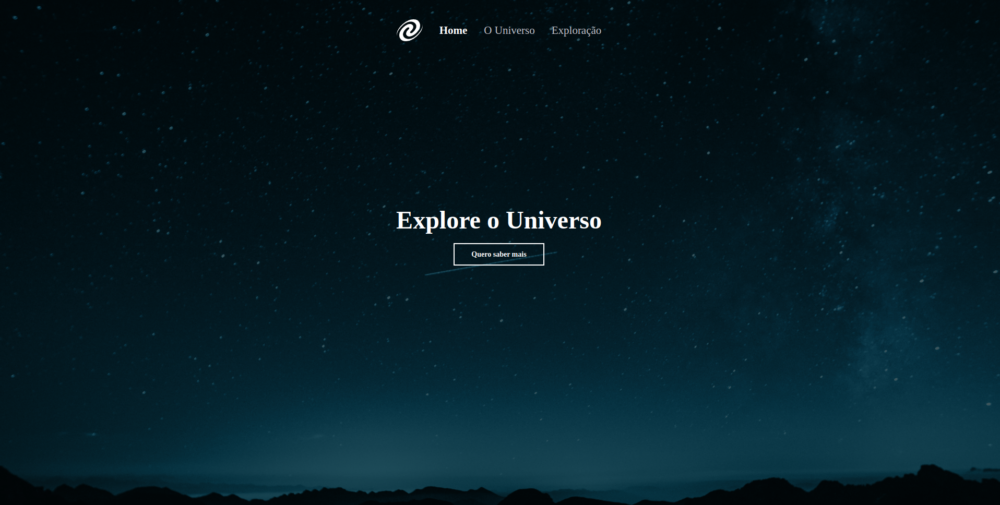

<h1 align="center"> Explore o universo </h1>

 

## 🚀 Tecnologias

Esse projeto foi desenvolvido com as seguintes tecnologias:

- HTML
- CSS
- JavaScript

 

 
<h3 align="center">Tela do projeto</h3>

 
  

 

 
<h3 align="center">Tela do projeto - 2</h3>

 
  

 

 
<h3 align="center">Tela do projeto - 3</h3>

 
  

 

 

## 💻 Detalhes

- Projeto possui o conceito de SPA

 

## 💻 Projeto

O projeto foi desenvolvido no curso **Explorer** da **Rocketseat** e tem como objetivo treinar as tecnologias utilizadas.
