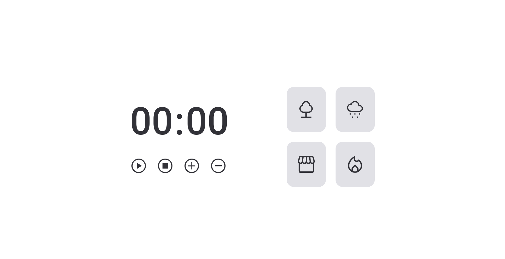

<h1 align="center"> FocusTimer 2.0 </h1>

 

## 🚀 Tecnologias

Esse projeto foi desenvolvido com as seguintes tecnologias:

- HTML
- CSS
- JavaScript

 

 
<h3 align="center">Tela do projeto</h3>

 
  

 

 

## 💻 Detalhes

- Projeto possui 4 tipo de sons ambientes diferentes;
- Adiciona e remove 5 minutos;
- Abaixo de 5 minutos é questionado ao usuário se deseja zerar ou manter o cronômetro;

 

## 💻 Projeto

O projeto foi desenvolvido no curso **Explorer** da **Rocketseat** e tem como objetivo treinar as tecnologias utilizadas.
