# Iniciando um projeto Node.

- npm init -y

Agora vamos criar as requisições, utilizando o framework Express

- npm install express

Utilizando o express

- Criar uma pasta src;
- Criar um arquivo server.js;
- Dentro do arquivo a primeira configuração é feita da seguinte forma:

```js
// Importando o express

const express = require("express");

// Inicializando o express

const app = express();

// Definiu o numero da porta que o API vai receber e retornar as requisições

const PORT = 3333;
app.listen(PORT, () => console.log(`Server is running on Port ${PORT}`));
```

## Utilização do get dentro da API

- Posteriormente vá no package.json e configure a inicialização do servidor. Configure nos scripts do package, como:

```js
  "scripts": {
    "start": "node local_onde_esta_o_server"
  },
```

- Utilizando o método get pela primeira vez no server:

```js
app.get("/", (request, response) => {
  response.send("Hello World!");
});
```

Você pode testar o código acima dentro do server.js que você criou na pasta src e acessar dentro do navegador para ver o hello world. O endereço acima é `localhost:3333`

## Route Params

Os route parameters nos permite mandar dados através da URL como meio. Um exemplo é mandar um ID de usuário para outro componento. Exemplo na prática a seguir:

- Agora vamos testar em prática o route params para a API.
  - Dentro do método get, iremos fazer os primeiros testes com o route params, da seguinte forma, esperando que volte o id informado e o usuário:

```js
app.get("/message/:id/:user", (request, response) => {
  response.send(`
    Mensagem ID: ${request.params.id}
    Para o usuário: ${request.params.user}
    `);
});
```

Esperando o seguinte resultado:

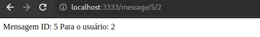

Observa-se que o id da mensagem e do usuário foi informado do link de busca e apareceu de forma dinamica na página.

É possível a utilização da desestruturação para pegar os parametros informados pelo usuário. Isso deixa o código mais limpo e evita que se repita o `request.params.qualquerParametro`. Veja o exemplo desestruturado:

```js
app.get("/message/:id/:user", (request, response) => {
  const { id, user } = request.params;

  response.send(`
    Mensagem ID: ${id}
    Para o usuário: ${user}
    `);
});
```

## Query Params

Recebe os dados da requisição como parâmetros na URL. Serve como um filtro para fazer consultas dentro da aplicação. Diferente do route params, o query params não é obrigatorio preencher toda a url para obter alguma requisição.

Em resumo, os Query Params são usados para parâmetros opcionais e de consulta, enquanto os Route Params são parte integrante da própria estrutura da rota, identificando recursos específicos.

- Verifique um teste utilizando query params:

```js
app.get("/users", (request, response) => {
  const { page, limit } = request.query;

  response.send(`Página: ${page}. Mostrar: ${limit}`);
});
```

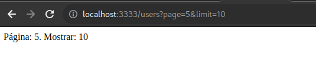

Veja no print que o primeiro parametro da url é passado logo apos o `?` e o segundo parametro é passado logo apos o `&`

## Nodemon

Utilizar o `Nodemon` serve como um living server. Fazendo o necessário para atualizar a aplicação sem reinicia-la

- Instalando o `Nodemon` como uma dependencia de desenvolvimento:
  - npm install nodemon --save-dev
- Apos a instalação vamos fazer a seguinte configuração para o ambiente de desenvolvimento na utilização do Nodemon, dentro do package.json:

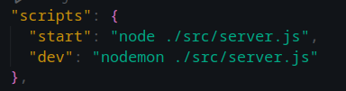

Agora dentro do ambiente de desenvolvimento, iremos iniciar a aplicação com o `npm run dev`.

## Insomnia - Inicializando pela primeira vez

Dentro do insomnia, vamos criar uma collection para trabalharmos diretamente em um projeto apenas.

Nesse caso iremos fazer um teste com o `POST` da nossa aplicação:

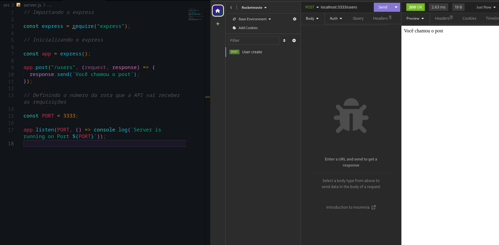

Observe como foi configurado dentro do código e como está sendo utilizado dentro do insomnia.

## Body Params

Apos configurar o `insomnia` iremos fazer as configurações para a utilização do método `POST`, da seguinte forma:

```js
// Inicializando o express

const app = express();

// Definir o conteudo da requisição em formato JSON
app.use(express.json());

app.post("/users", (request, response) => {
  const { name, email, password } = request.body;

  response.json({ name, email, password });
});
```

Observe a forma que dentro do insmonia irá retornar:

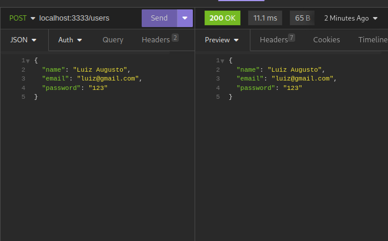

É de extrema importancia utilizar o método `use` no app para definir o conteudo da requisição em formato json e dentro do método `POST` definir o retorno em formato json também.


## Organizando a estrutura

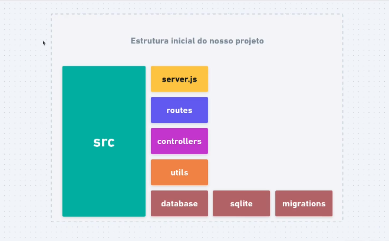


### Organizando a pasta Routes e codando:

- Após as configurações feitas anteriormente, iremos criar uma pasta `routes` dentro da `src`

- Agora iremos criar a rota dos `users` aqui como exemplo, mas isso pode variar de projeto e a rota desejada. 

- Após a criação do arquivo de rota, iremos configurar da seguinte forma:

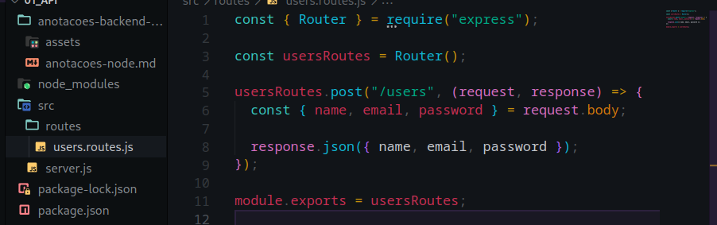

É de extrema importância importar o `Router` do express e exportar a rota criada.

- Posteriormente, iremos criar um arquivo como sumario das rotas. Iremos colocar o nome dele de `index.js` dentro da pasta `routes` e a configuração será da seguinte forma:

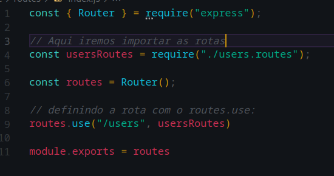

- Também podemos omitir a informação da url no arquivo de rota em particular. Nesse caso, iremos omitir a informação `users` do arquivo `users.routes.js` da seguinte forma:


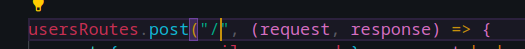

*Diferente de antes, o parametro era definido dentro do arquivo e com a criação do `index.js`, isso pode ser omitido.*

- Agora iremos configurar dentro do `server.js`:

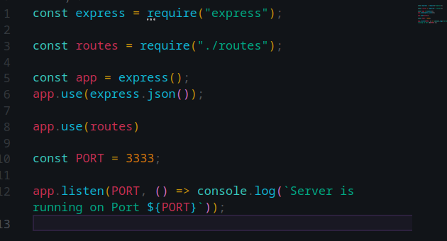

*Verifique que importamos as routes e omitimos o arquivo index.js e posteriormente iniciamos o routes com o app.use*


### Organizando a pasta Controllers e codando:

Controllers é a camada responsável para processar as requisições da nossa aplicação.

- Iremos primeiro criar uma pasta `controllers` dentro da `src`. Nesse exemplo coloquei o nome de `UsersController.js`

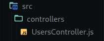

<br>

**Dentro do `controller` criado é importante ter ciencia que so pode ter cinco métodos. Sendo eles:**


 * index - GET para listar vários registros.
 * show - GET para exibir um registro especifico.
 * create - POST para poder criar um registro.
 * update - PUT para atualizar um registro.
 * delete - DELETE para deletar um registro
 
# 

- Dentro do `controller`` criado para o exemplo, vamos configurar ele para criar um usuário no nosso banco de dados 

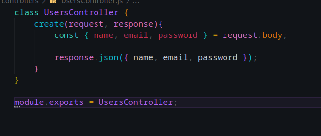

Como podem ver, foi criado um metodo de `create`, utilizando o `POST` e a função está dentro do `controller` de `users`.

## Retornando para a pasta routes

Dentro da pasta routes, o arquivo de rota criada para `users` ficou da seguinte forma:

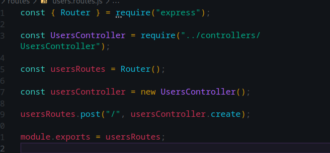

Observe que, na linha 3, importamos a classe `UsersController` juntamente com os métodos associados. Em seguida, na linha 7, estabelecemos um mecanismo para que, sempre que uma solicitação POST for feita em `./`, seja gerada uma nova instância do controlador, neste caso, responsável por criar usuários. 