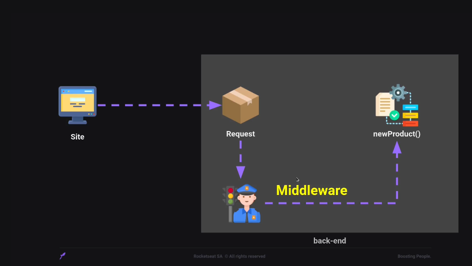

# API

- API funciona como um resturante na onde tem o cliente, garçom e cozinha.

## Funcionamento:

- O cliente faz o pedido ao garçom, que irá levar diretamente para a cozinha e posteriormente irá trazer o pedido para o cliente. Sendo assim a API, funciona desta forma, na onde o CLIENTE (site/mobile) faz o pedido ao GARÇOM(NODE.JS) que irá levar a COZINHA (Server) e irá retornar com o pedido solicitado para o cliente.

# O que é o Node.JS?

- Ele não é uma linguagem de programação! Ele é um ambiente que oferece recursos que permite escrever e executar aplicações JavaScript. _JS RunTime Enviroment_

# Para que serve o Node.JS?

- Serve para fazer o que você quiser, desde sites à scripts de automação. Incluindo, a criação de API.

# Onde o Node.Js é utilizado?

- Backend;
- FrontEnd;
- Micro serviços;
- API:
  - Web;
  - Desktop;
  - Mobile.
- Scripts de automação;
- I.A;
- Machine Learning;

# Quais as vantagens do Node.JS?

- Rápido;
- escalável;
- Aplicações de ponta;
- Js everywhere;
- Ecosistema gigante;
- Amplamente utilizada;

# O que é o v8 Engine?

v8 é o interpretador JavaScript.

# Métodos de requisições

- GET - Leitura;
- POST - Criação;
- PUT - Atualização;
- DELETE - Deleção;
- Patch - Atualização parcial.

# HTTP Codes
- 100:
  - Informativo ;

- 200:
  - Sucesso;

- 300:
  - Redirecionamento;

- 400: 
  - Erro do cliente;

- 500: 
  - Erro interno;

# Middleware

Middleware são funções que tem acesso ao objeto de solicitação (requisição), o objeto de resposta (resposta), e a próxima função de middleware no ciclo de solicitação-resposta do aplicativo.

A próxima função middlware é comumente denotada por uma variavel chamada next.

- Exemplo:



- Eles podem:
  - Executar qualquer código;
  - Fazer mudança nos objetos;
  - Encerrar o ciclo de solicitação-resposta;
  - Chamar o próximo middleware na pilha.


- Utilizando ele na prática:

```js

function myMiddleware(request, response, next) {

console.log("Você passou pelo middleware")

// Verificando se o usuário é admin, caso não: 

if(!request.body.isAdmin){
    return response.json({message: "user unauthorized"})
}

next();

}

// Criando instancias

const usersController = new UsersController();

// Importante colocar assim para definir o middleware na rota desejada

usersRoutes.post("/", myMiddleware, usersController.create);
```


- Utilizando o método de requisição GET e desestruturar o route params:

```js
app.get("/message/:id/:user", (request, response) => {
  const { id, user } = request.params;

  response.send(`ID da mensagem: ${id}. Para o usuário: ${user}`);
});
```

Vale lembrar que utilizar o route params faz com que seja obrigatorio preencher o caminho da forma correta para responder

- Utilizando o método de requisição GET e desestruturar o query params:

```js
app.get("/users", (request, response) => {
  const { page, limit } = request.query;

  response.send(`Página: ${page}. Mostrar: ${limit}`);
});
```

Agora iremos instalar um liveserver para o backend como dependencia apenas de desenvolvimento:

- npm install nodemon --save-dev

- Utilizando o método post e definindo o corpo da requisição:

```js
// definindo o padrão do corpo da requisição

app.use(express.json());

app.post("/users", (request, response) => {
  const { name, email, password } = request.body;

  response.json({ name, email, password });
});
```

Também posso utilizar o response.send para retornar em html, mas utilizar o json, ao utilizar o post vai retornar um JSON com as informações passadas.

- Criando rotas para o server em outro arquivo:

```js
// Exportando o Router do express

const { Router } = require("express");

// Criando a rota dos usuários

const usersRouter = require("./users.routes");

// Executando

const routes = Router();

// Utilizando a rota criada
routes.use("/users", usersRouter);

// Exportando o grupo de rotas

module.exports = routes;
```

- Utilizando a rota no script principal:

```js
// Utilizando as rotas

const routes = require("./routes");
```
- O tratamento de excesso terá que se instalar uma nova biblioteca:
  - npm install express-async-errors --save

-