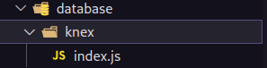
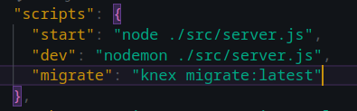
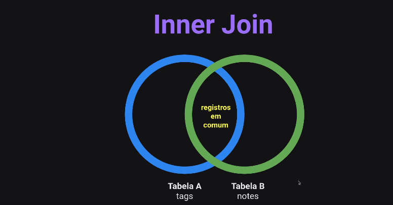

# O que é um banco de dados?

Banco de dados é uma coleção de dados.

# Estrutura de um Banco de Dados

Todo banco de dados há uma estrutura para armazenar esses dados. Separando-os em seus devidos lugares.

# Banco de dados Relacional

Normalmente esse banco de dados é construido por tabelas. Facilitando as relações das atividades do usuário.

# Instalando o SQL

- npm install sqlite3 sqlite --save

# SGBD

Sistema gerenciador de Banco de Dados;

- beekeeper;
- sqlstudio;

# SQL

SQL não é um banco de dados! SQL é uma linguagem de consulta estruturada.

## Grupo de comandos do SQL

### DDL: Data Definition Language

    - Create - criar tabela;
    - Drop - deletar uma tabela;
    - Alter - atualizar alguma informação da tabela.

- Utilizando DDL no banco de dados:

- CREATE:

```sql
CREATE TABLE users (
    id INTEGER PRIMARY KEY AUTOINCREMENT,
    name VARCHAR,
    email VARCHAR,
    password VARCHAR,
    avatar VARCHAR NULL,
    created_at TIMESTAMP DEFAULT CURRENT_TIMESTAMP,
    updated_at TIMESTAMP DEFAULT CURRENT_TIMESTAMP,
)
```

### DML: Data Manipulation Language

    - C - create - comando é insert;
    - R - read - comando é select;
    - U - update - comando é update;
    - D - delete - comando é delete.

- Utilizando DML no banco de dados:

- INSERT - estou inserindo um usuário na minha tabela:

```sql
INSERT INTO users
(name, email, password)
VALUES
('Luiz', 'luiz@email.com', '123')
```

- SELECT - estou visualizando a minha tabela:

```sql
SELECT * FROM users;
```

-UPDATE - Estou atualizando um usuário já existente(where serve para selecionar um unico usuário, se não será atualizado todos os usuários da tabela):

```sql
UPDATE users SET
avatar = 'luiz.png'
WHERE id = 1
```

_Caso deseje atualizar mais de um campo, basta colocar uma virgula e ir adicionando_

- DELETE - para deletar alguma informação em especifica:

```sql
DELETE FROM users
WHERE id = 2
```

# Criptografando senhas no banco de dados:

- npm install bcryptjs;

# SQL Query Builder

Query Builder é um construtor de consulta. O query builder permite que você construa instruções SQL independente do banco de dados utilizado.

## Utilizando em codigo

### Instalando Knex

- npm install knex --s

### Configurando Knex

- npx knex init

- Posteriormente apagar tudo do arquivo knefile.js, deixando da seguinte forma:

```js
module.exports = {
  development: {
    client: "sqlite3",
    connection: {
      filename: "local do arquivo onde está o banco de dados",
    },
  },
};
```

Isso se trata de uma configuração de conexão do knex com o banco de dados.

- Para resolver a conexão com o banco de dados, eu indico a importação do path, para evitar erros. Deixando da seguinte forma:

```js
const path = require("path");
module.exports = {
  development: {
    client: "sqlite3",
    connection: {
      filename: path.resolve(__dirname, "src", "database", "database.db"),
    },
  },
};
```

_\_\_dirname é partindo desta pasta._

- Após essa configuração, adicione o `useNullAsDefault: true` logo apos o development

```js
const path = require("path");
module.exports = {
  development: {
    client: "sqlite3",
    connection: {
      filename: path.resolve(__dirname, "src", "database", "database.db"),
    },
    useNullAsDefault: true,
  },
};
```

- Criando o arquivo knex logo apos as configurações acima

- O arquivo no curso foi criado dentro da pasta do database. da seguinte forma:
  
- Conteudo do index.js:

```js
// Importando as configurações feita no knexfile
const config = require("../../../knexfile");

// Importando o knex
const knex = require("knex");

// Criando a conexão
const connection = knex(config.development);

// exportando a conexão
module.exports = connection;
```

### Migrations

É uma forma de versionar a base de dados.

Migrations trabalha na manipulação da base de dados: criando, alterando ou removendo.

#### Métodos de uma Migrations

- UP: Método responsável por criar ou alterar algo no banco de dados.

- DOWN: responsável pelo rollback. Sendo assim, desfazer as alterações realizadas pela migrations.

### Configurando Migrations na prática

- Primeiramente, vá no knexfile.js e mostre onde ele vai armanezar as migrations criada, deixando da seguinte forma:

```js
const path = require("path");
module.exports = {
  development: {
    client: "sqlite3",
    connection: {
      filename: path.resolve(__dirname, "src", "database", "database.db"),
    },
    migrations: {
      directory: path.resolve(
        __dirname,
        "src",
        "database",
        "knex",
        "migrations"
      ),
    },
    useNullAsDefault: true,
  },
};
```

#### Rodando a migrations:
- npx knex migrate:make "nome_da_migration"

- é possível criar um script para executar sempre que quiser essa make, da seguinte forma, dentro do package.json:
  


#### Configurando a migration criada:
- Dentro do arquivo criado pela migration, o curso ensina a configurar da seguinte forma:

````js

// Processo de criar a tabela:
exports.up = knex => knex.schema.createTable("nome_da_table", (table) => {
    // Exemplo de tabela criada:
    table.increments("id");
    table.text("title")
    table.text("description");
    table.integer("user_id").references("id").inTable("users");

    table.timestamp("created_at").default(knex.fn.now())
    table.timestamp("updated_at").default(knex.fn.now())
});

// Processo de deletar a tabela:
exports.down = knex => knex.schema.dropTable("nome_da_table");

````

| Atenção                      | 
|------------------------------------------|
| Há uma grande diferença entre  **npm** e **npx**     |

#### Npm:

**NPM** é uma ferramenta que usa para instalar pacotes;

#### Npx:

**NPX** é uma ferramenta que usa para executar pacotes.


| Atenção                      | 
|------------------------------------------|
| Qual é a diferença entre  **Primary key** e **Foreign key**?     |

#### Primary key

A **Primary Key** é uma chave de identificação exclusiva gerada internamente pelo banco de dados. Por exemplo, o ID de um usuário em sua plataforma é um exemplo de Primary Key, sendo esse ID gerado pelo banco de dados.

#### Foreign key:

A **Foreign Key** é uma chave que provém de outra tabela. No contexto de criar um usuário, o ID associado a esse usuário no banco de dados é enviado a um serviço externo para identificar quem está acessando esse serviço. Portanto, funciona como uma chave secundária para estabelecer relações entre tabelas.

### Configurando os deletes em cascata no banco de dados:

Para habilitar a função de delete em cascata no banco de dados, é necessário habilitar no knexfile.js da seguinte forma:

````js

   pool: {
      afterCreate: (conn, cb) => conn.run("PRAGMA foreign_keys = ON", cb)
    },

````

Ele será mais uma propriedade do arquivo, assim como mostrado anteriormente.

### Inner Join

Unir tabelas. Uma unica consulta será capaz de receber os dados das duas tabelas em uma só. Registros em comum apenass!!

  ;


