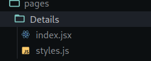
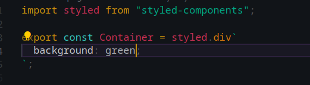
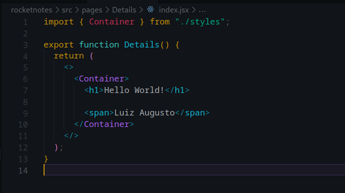
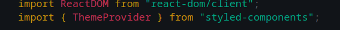
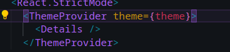
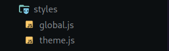
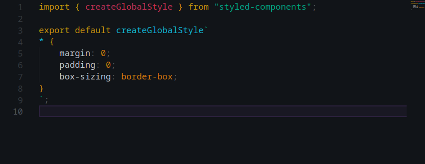
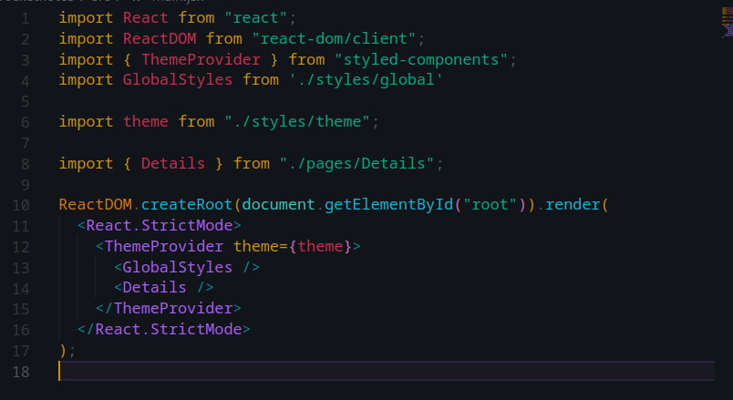

# Pré Processadores CSS

Um CSS pré processador quer dizer que você não vai utilizar esse arquivo em produção. Na verdade, ele será processado para utilização final no css da sua aplicação.

## Qual a vantagem?

- facilidade na manuntenção;
- ajuda a escrever código mais limpo;
- organização;
- Possui a minificação do arquivo.

## CSS-in-Js

CSS-in-JS aproveita os metodos atuais de componetização em javascript para criar componentes.

## Styled Components

Styled Components foi desenvolvido para melhorar a maneira que lidamos com o css nos componentes.

#### Vantagens do Styled Components

- Sem colisão de classes;
- Desempenho;
- Estilo dinâmico;
- Manunteção sem dor.

##### Instalando Styled Components

**https://styled-components.com/**

- npm install --save styled-components

###### Como importar o Styled Components e utilizar nos primeiros passos:

- A estrutura utilizada para componente no curso foi desta forma:

- O css será executado dentro do `style.js`. Sendo criado como um componente que será exportado da seguinte forma:

###### Definindo um tema pelo Styled Components

_Primeiro você terá de importar o `ThemeProvider` do Styled Components da seguinte forma_

_E aplicando assim_

###### Definindo configurações globais com o Styled Components

_A organização das pastas passada pelo curso_

_E o arquivo já configurado assim:_

_Não esqueça de importar o global dentro do ThemeProvider_

