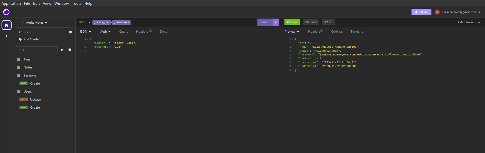

# Fluxo de Autenticaçao

Etapas que o usuário vai passar para ele se conectar a aplicação. Permitindo que ele possa ter uma conta e realizar atividades como:

- Atualizar cadastro;
- Utilização da aplicação com a própria conta;


Após autenticado o usuário irá receber um Token de acesso, possibilidando ele realizar ações dentro da aplicação com uma identificação. Como um crachá para acessar a empresa.
Verifique o fluxo após a obtenção do Token:


## Fluxo de Autenticação na prática:

### Criando o controller e estruturando

Primeiramente iremos criar um controller de autenticação. Conforme o projeto está organizado, iremos criar esse controller dentro da pasta `controllers` na API e a estrutura é esta:

- Estrutura de pasta:


- Estrutura de código:

```javascript
class SessionsController {
  async create() {}
}

module.exports = SessionsController;
```

Ainda utilizando a ideia de criar `Class`.

### Criando a rota do controller

Dentro da pasta rotas, iremos criar um arquivo para definir a rota de autenticação de usuário.
Iremos seguir a mesma estrutura passada anteriormente sobre rotas no projeto:

- Estrutura de pasta:


- Estrutura de código dentro do arquivo routes:

```javascript
const { Router } = require("express");

const SessionsController = require("../controllers/SessionsController");

const sessionsController = new SessionsController();

const sessionsRoutes = Router();

sessionsRoutes.post("/", sessionsController.create);

module.exports = sessionsRoutes;
```

Posteriormente, vá no `index.js` das rotas e insira a nova rota:


- Para manter a organização de acesso no Insomnia, criamos uma nova pasta com os métodos desta forma:


Vale ressaltar que há as configurações de `Environment` já configuradas e é sempre importante ter para manter tudo na melhor forma possível.

### Validação do usuário no controller

Nesse primeiro momento, iremos importar o knex para ter um contato com o banco de dados e já de inicio, também importaremos nosso AppErros.js para lidar com exceções no futuro. Ficando assim:

- Estrutura de código:

```javascript
// Importando a conexão com o banco de dados:
const knex = require("../database/knex");

// Importando AppError, para lidar com exceções
const AppError = require("../utils/AppError");

class SessionsController {
  async create(request, response) {
    const { email, password } = request.body;

    const user = await knex("users").where({ email }).first();

    return response.json(user);
  }
}

module.exports = SessionsController;
```

Repare bem na função de criar a sessão que estamos utilizando o knex para acessar a tabela `users` e buscando pelo campo `email` e puxando o primeiro cadastro que tem com as informações passadas.
Ficando assim na resposta da requisição, via Insomnia:



- Primeira validação (login):

```javascript
// Importando a conexão com o banco de dados:
const knex = require("../database/knex");

// Importando AppError, para lidar com exceções:
const AppError = require("../utils/AppError");

class SessionsController {
  async create(request, response) {
    const { email, password } = request.body;

    const user = await knex("users").where({ email }).first();

    // Caso o usuário não exista, seja por algum motivo:
    if (!user) {
      throw new AppError("E-mail e/ou senha incorreta", 401);
    }

    return response.json(user);
  }
}

module.exports = SessionsController;
```

Caso o usuário esteja errando o login ou colocando um inexistente o erro será apresentado desta forma:


- Segunda validação (password):

```javascript
// Importando a conexão com o banco de dados:
const knex = require("../database/knex");

// Importando AppError, para lidar com exceções:
const AppError = require("../utils/AppError");

// Verificar a senha criptografada:
const { compare } = require("bcryptjs");

class SessionsController {
  async create(request, response) {
    const { email, password } = request.body;

    const user = await knex("users").where({ email }).first();

    // Caso o usuário não exista, seja por algum motivo:
    if (!user) {
      throw new AppError("E-mail e/ou senha incorreta", 401);
    }

    // Verificar senha criptografada do banco:

    const passwordMatched = await compare(password, user.password);

    if (!passwordMatched) {
      throw new AppError("E-mail e/ou senha incorreta", 401);
    }

    return response.json(user);
  }
}

module.exports = SessionsController;
```

Caso o usuário esteja errando o login ou colocando um inexistente o erro será apresentado desta forma:


**Vale ressaltar que os erros são os mesmo para evitar que tenha algum espertinho, que tente se aproveitar de uma especificação do erro. Como "o e-mail não confere"**

### JWT

Json Web Token, é um padrão de mercado que define um token no formato JSON para a troca de informações.

JWT não representa o mecanismo de autenticação. Mas é um meio para a troca de informações no fluxo de autenticação.


#### Instalando o Json Web Token

- npm install jsonwebtoken

- Após a instalação, seguindo a organização do projeto oferecido no curso, vá na pasta src e crie um diretorio chamado `configs` com um arquivo dentro chamado `auth.js`. Desta forma:


- Dentro do `auth.js` a primeira configuração é desta forma:

```javascript
module.exports = {
  jwt: {
    secret: "default",
    expiresIn: "1d",
  },
};
```
- Agora retornaremos ao Controller já criado anteriormente para a autenticação e configuraremos a criação do Token desta forma:

```javascript
// Importando a conexão com o banco de dados:
const knex = require("../database/knex");

// Importando AppError, para lidar com exceções:
const AppError = require("../utils/AppError");

// Importando a configuração de autenticação do JWT:

const authConfig = require("../configs/auth");

// Importando metodo do JWT:

const { sign } = require("jsonwebtoken");

// Verificar a senha criptografada:
const { compare } = require("bcryptjs");

class SessionsController {
  async create(request, response) {
    const { email, password } = request.body;

    const user = await knex("users").where({ email }).first();

    // Caso o usuário não exista, seja por algum motivo:
    if (!user) {
      throw new AppError("E-mail e/ou senha incorreta", 401);
    }

    // Verificar senha criptografada do banco:

    const passwordMatched = await compare(password, user.password);

    if (!passwordMatched) {
      throw new AppError("E-mail e/ou senha incorreta", 401);
    }

    // Gerando o token para o usuário

    const {secret, expiresIn} = authConfig.jwt;
    const token = sign({}, secret, {
      subject: String(user.id),
      expiresIn
    })

    return response.json({user, token});
  }
}

module.exports = SessionsController;

```

Verifique desde a importação ao comentário de onde está sendo gerado o token. A resposta no insomnia será desta forma já com o token gerado:


